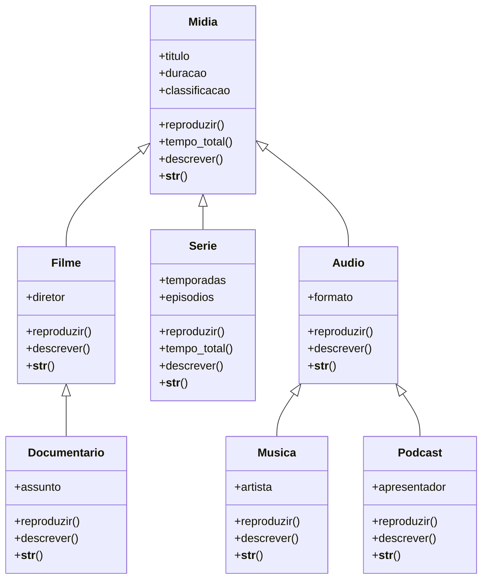

# Diagrama de Classes - Plataforma de Streaming (Parte 1)

Diagrama da hierarquia de classes da Parte 1 (Aula 04 - Herança e Polimorfismo) do Grupo 1.

```mermaid
classDiagram
    class Midia {
        +titulo
        +duracao
        +classificacao
        +reproduzir()
        +tempo_total()
        +descrever()
        +__str__()
    }

    class Filme {
        +diretor
        +reproduzir()
        +descrever()
        +__str__()
    }

    class Documentario {
        +assunto
        +reproduzir()
        +descrever()
        +__str__()
    }

    class Serie {
        +temporadas
        +episodios
        +reproduzir()
        +tempo_total()
        +descrever()
        +__str__()
    }

    class Audio {
        +formato
        +reproduzir()
        +descrever()
        +__str__()
    }

    class Musica {
        +artista
        +reproduzir()
        +descrever()
        +__str__()
    }

    class Podcast {
        +apresentador
        +reproduzir()
        +descrever()
        +__str__()
    }

    Midia <|-- Filme
    Filme <|-- Documentario
    Midia <|-- Serie
    Midia <|-- Audio
    Audio <|-- Musica
    Audio <|-- Podcast
```
